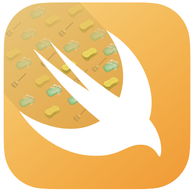
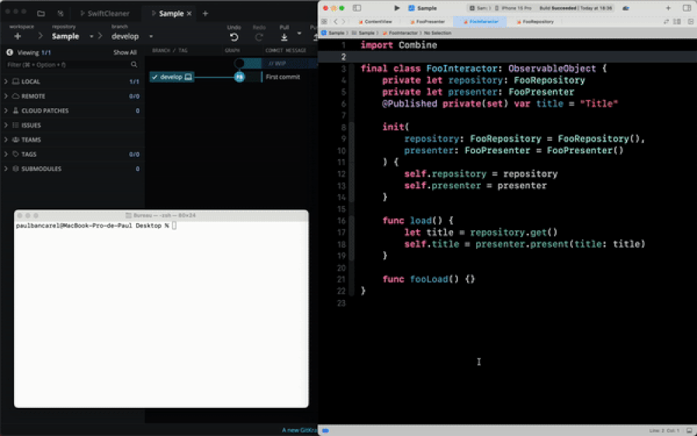

<h1 align="center">
  
  <br>
</h1>
<p align="center">
<a href="https://github.com/paul1893/SwiftCleaner/actions">
  
</a>

<br>
<br>
</p>

# SwiftCleaner

A tool to automatically remove dead code in your codebase.

# How to use

1. Download the release on Github 
2. Run

```swift
SwiftCleaner 
    --workspace ./FooProject.xcworkspace \
    --scheme FooScheme \
    --destination "platform=iOS Simulator,OS=18.2,name=iPhone 16 Pro"
    
// OR

SwiftCleaner 
    --project ./FooProject.xccodeproj \
    --scheme FooScheme \
    --destination "platform=iOS Simulator,OS=18.2,name=iPhone 16 Pro"
```

> 💡 `scheme` & `target` options are optional. SwiftCleaner fulfill scheme & target as name of the project if missing.

# How it works
<h1 align="center">
  
  <br>
</h1>

## Theory
SwiftCleaner rely on [Periphery](https://github.com/peripheryapp/periphery) and SwiftEraser.  
Periphery is a tool able to identify dead declarations and expose them as a JSON report. On large project it could be thousands of occurences. Applying these deletions could take time for a developer. That's when SwiftCleaner comes into place. SwiftCleaner is able to read this Periphery's report. Each node of the JSON is then converted into a Swift Syntax node and kept in memory. SwiftCleaner will then ask SwiftEraser to apply these deletions on the codebase automatically. They both heavily rely on [SwiftSyntax](https://github.com/apple/swift-syntax).

⚠️ Even if it's a deterministic process. The current version could have some edge cases that must be resolved manually after running SwiftCleaner (see [F.A.Q](#faq) section). Engine has been tested on large codebase 1M+ lines of code (loc) but limitations exist.

Periphery give us text informations as JSON format about where the deadcode is located. We need to convert this information to Swift Syntax nodes. A naïve approach is to go through the tree until reaching the value then go in the reverse direction to found the nearest parent node that is actor, class, enum, struct, protocol or extension. This first "search nodes" operation could be runned concurrently.
This search nodes operation is mandatory as we cannot trust the position from periphery as the file could have been modified by previous statements operations.

The more Periphery will improved the more SwiftCleaner will improved too as SwiftCleaner is basically just a Periphery report reader with some rules to take care of deletion properly.  
If Periphery forgot to mention some deletion we can't do anything but sometimes we could apply some smart deletion to guarantee compilation at a certain cost (sometimes we need to iterate again through all the Swift statements file).

Here's the smart deletion applied:
- Delete the declaration if his members becomes empty
- Delete the file if it becomes empty or only contains import and/or comments
- Apply transivity protocol conformance on a declaration if a protocol is deleted
- Avoid property deletion if it rely on a `CodingKey` 

## Flags

- `--skip-build` use this flag to skip build. Only use this flag if you are sure to have cache in your DerivedData folder.
- `--only-import` use this flag to only delete unused import accross your files.
- `--verbose` use this flag to print additional information when running SwiftCleaner.

# Supported
If one of these is reported as not used, they will be deleted:

- Unscoped variables
- Unscoped typealias
- Unscoped functions
- Class
- Struct
- Extension
- Protocol
- Actor
- Enum
- Cases in an enum
- Properties
- Subscript functions
- Functions
- Init functions
- Static functions
- Unused import

# Not supported
If one of these is reported as not used, they will NOT be deleted in the current version:

- Properties that are only assigned and never used. Xcode will trigger a warning for them.
- typealias nested in Class, Enum, Struct, Actor, Protocol, Extension

# F.A.Q

## Is my code source sent to a server ?
No. All analysis are computed locally on your device. Nothing sent to a server.

## Why is my new APIs are deleted ?
If you use trunk base development. For example pushing an unfinished feature, let's say a class that is making an API call but not connected to any UI. This code can be detected as dead code and then deleted. Always review the files after running SwiftCleaner.
  
You can annotate some of your code to not being deleted:

```swift
// periphery:ignore
class MyClass {}
```
[Read more](https://github.com/peripheryapp/periphery?tab=readme-ov-file#comment-commands)

## Why some dead members are not found or some are false positive ?
Because Periphery is not 100% accurate and could have false positive or unmatched dead members. SwiftCleaner could also delete some stuff that should not be deleted. Use SwiftCleaner as an helper tool and always review what's proposed to be deleted.

## Why is my codebase is not compiling after running ? (Known limitations)

- Extension located on another file of an Actor/Class/Struct that is detected as unused

```swift
// Foo.swift
struct Foo {
    let name: String
}

// Bar.swift
struct Bar {
    let name: String
}

extension Foo: Codable {
    init(bar: Bar) {
        self.name = bar.name
    }
}
```
If Foo is detected as an unused class there is chance that Periphery does not reference `extension Foo` in Bar.swift as deadcode too. Resulting in the fact that the developer will have to remove it manually.

- Property deleted but init still use this property in another file

```swift
// Foo.swift
struct Foo: Equatable {
    let address: String
    let zipcode: String
    let city: String // Let's say Periphery's report this property as unused
    let countryCode: String
}

// Foo+Extensions.swift
extension Foo: FooProtocol {
    init(from dto: FooDTO) throws {
        self.init(
            address: dto.address,
            zipcode: dto.zipcode,
            city: dto.city, // Compiler will complains. It is not reported by Periphery needs to be deleted manually
            countryCode: dto.countryCode
        )
    }
}
```

- Property deleted but this property is override.

```swift
// Foo.swift
class Foo {
 var property: Int // Let's say Periphery's report this property as unused
}

// Bar.swift
class Bar {
    override var property: Int // Compiler will complains. Property is used in child declaration this property is not reported by Periphery and override could not be removed automatically in child declation. override keyword must be removed manually.
}
```

- Type only consumed through a typealias

```swift
typealias Foo = Bar // Let's say that in all your codebase Bar is never used. Only used through Foo. If Periphery annotates Bar as to be deleted this line will result in a compiling error and should be removed manually.
``` 

- associatedType is detected as deadcode and remove, there high chance that if it has been used in a where clause. The where clause is not marked as deadcode too and not deleted.

```swift
protocol FooProtocol {
    associatedType ViewModel // Let's say Periphery's report this associatedType as unused
    // ...
}
class Foo<ContentView: UIView & FooProtocol, ViewModel: Hashable> where FooProtocol.ViewModel == ViewModel // This ContentView.ViewModel is not marked as deadcode and should be deleted manually
```

- Some class are not detected as unused but only his initializer resulting in a broken class, in this case you just have to delete the class manually.

- Avoid property deletion if it rely on a `CodingKey` 

```swift
// Foo.swift
struct Foo: Decodable {
    let identifier: String
    let name: String
    
    enum CodingKeys: String, CodingKey {
        case identifier = "id"
        case name
    }
}
```
If `identifier` is detected as an unused property, Periphery will not reference the case in the CodingKeys as deadcode too. Resulting in the fact that the developer will have to remove it manually.  
Note that if Foo & CodingKeys must be in the same file for this optimisation.

With CodingKeys optimization property will not be deleted but if the type is deleted in parallel could lead to compile error.

```swift
  struct FooDTO: Decodable {
    let activated: [String]?
    let eligible: [String]?
    let ineligible: IneligibleDTO? // Let's say Periphery's report this property as unused (not deleted because of #how-it-works section), and another node report IneligibleDTO as not used. IneligibleDTO will be deleted but this line will result compiling error.
    
    enum CodingKeys: String, CodingKey {
        case activated = "_activated"
        case eligible = "_eligible"
        case ineligible = "_ineligible"
    }
}
```
- If protocol are deleted some affectation can becomes wrong.

```swift
class Foo {
    private(set) var coordinator: (any FooProtocol)?

    func foo(_ bar: Bar) {
        coordinator = bar
     }   
}

protocol BarProtocol: FooProtocol {} // Let's say Periphery's report this protocol as unused
class Bar: BarProtocol {} // Compiler will indicates BarProtocol does not exists anymore.
```

If these declarations are within same file, SwiftCleaner will handle transitivity automatically for you.
 
Let's consider this:

```swift
protocol FooProtocol: BarProtocol {}
class Foo: FooProtocol {}

// If FooProtocol is marked as to be deleted, it will becomes:

class Foo: BarProtocol {}
```
Note that if Foo & FooProtocol must be in the same file for this optimisation.

## Periphery version
- Based on [Periphery 3.1.0](https://github.com/peripheryapp/periphery/releases/tag/3.1.0) commit: 241bbdc
